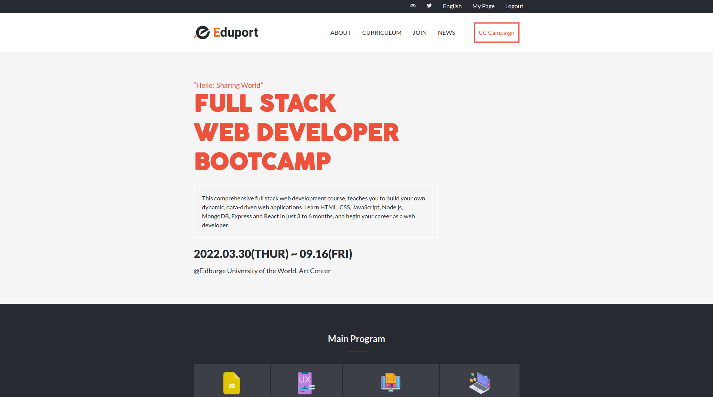

# Microverse-Capstone-Project
The first module capstone project.



> A webpage for online bootcamp with all the contents and instructors.

## Built With

- HTML, CSS & JS
- Hint, Stylelint, Eslint

## Live Demo (if available)

[Web Development Course](https://ezekielutshudi.github.io/Microverse-Capstone-Project/)

## Getting Started

To get a local copy up and running follow these simple example steps.

### Prerequisites

```
node and npm
```

### Setup

```
- clone the repo
- cd into it
- npm install
```

### Install

```
open the html file
```

### Usage

```
navigate through the pages to see different contents
```

### Deployment

```
set up on github pages
```

## Authors

👤 **Max The Stranger**

- GitHub: [@EzekielUtshudi](https://github.com/EzekielUtshudi)
- Twitter: [@UtshudiEzekiel](https://twitter.com/UtshudiEzekiel)
- LinkedIn: [@UtshudiEzekiel](https://www.linkedin.com/in/ezekiel-utshudi-195782162/)

## 🤝 Contributing

Contributions, issues, and feature requests are welcome!

Feel free to leave a comment [issues page](https://github.com/EzekielUtshudi/Microverse-Capstone-Project/issues).

## Show your support

Give a ⭐️ if you like this project!

## Acknowledgments

- Hats off to the UI/UX designer Cindy Shin [@adagio07](https://www.behance.net/adagio07)

## 📝 License

This project is [MIT](./MIT.md) licensed.
